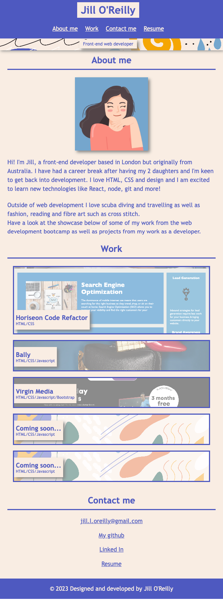

# Jill O'Reilly web development portfolio

## Description

This portfolio webpage showcases the front-end development skills I have gained through the Front-end web development bootcamp provided by EdX as well as my previous work as a web developer.

## Usage

- Jill O'Reilly's portfolio webpage can be accessed online on Github pages: [https://jilloreilly.github.io/jill-oreilly-portfolio/](https://jilloreilly.github.io/jill-oreilly-portfolio/)
    - The __navigation__ will take you to the following sections:
        - **About me** contains an avatar image and a short paragraph about me and my experience as a web developer
        - **Work** showcases projects I've worked on through the bootcamp or previous work as a developer. Clicking on a link will open the deployed site in a new tab or window
        - **Contact me** contains links to email me, my github page, my Linked in page and my CV.

- The website has been optimised for viewing across all devices. Please see below for screenshots of desktop and mobile view of the page: 

**Desktop**

**Mobile**

## Credits

Thank you to the following: 

- CSS Tricks for tips on [Flexbox](https://css-tricks.com/snippets/css/a-guide-to-flexbox/) and [grids](https://css-tricks.com/snippets/css/complete-guide-grid/)
- W3C Schools for [CSS variables](https://www.w3schools.com/css/css3_variables.asp), [CSS combinators](https://www.w3schools.com/css/css_combinators.asp)
- Stack overflow for [transparent overlay](https://stackoverflow.com/questions/17859993/basic-css-how-to-overlay-a-div-with-semi-transparent-div-on-top)
- Hero image from [freepik](https://www.freepik.com/free-vector/hand-drawn-abstract-organic-shapes-background_6674913.htm#from_view=detail_alsolike#position=10)
- Avatar designed on [Canva](https://www.canva.com/)
- Favicons - [favicon.io](https://favicon.io/favicon-converter/)

## License

MIT License

Copyright (c) 2023 Jill O'Reilly

Permission is hereby granted, free of charge, to any person obtaining a copy
of this software and associated documentation files (the "Software"), to deal
in the Software without restriction, including without limitation the rights
to use, copy, modify, merge, publish, distribute, sublicense, and/or sell
copies of the Software, and to permit persons to whom the Software is
furnished to do so, subject to the following conditions:

The above copyright notice and this permission notice shall be included in all
copies or substantial portions of the Software.

THE SOFTWARE IS PROVIDED "AS IS", WITHOUT WARRANTY OF ANY KIND, EXPRESS OR
IMPLIED, INCLUDING BUT NOT LIMITED TO THE WARRANTIES OF MERCHANTABILITY,
FITNESS FOR A PARTICULAR PURPOSE AND NONINFRINGEMENT. IN NO EVENT SHALL THE
AUTHORS OR COPYRIGHT HOLDERS BE LIABLE FOR ANY CLAIM, DAMAGES OR OTHER
LIABILITY, WHETHER IN AN ACTION OF CONTRACT, TORT OR OTHERWISE, ARISING FROM,
OUT OF OR IN CONNECTION WITH THE SOFTWARE OR THE USE OR OTHER DEALINGS IN THE
SOFTWARE.

## Technologies Used

